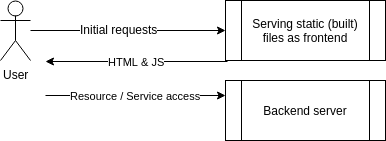
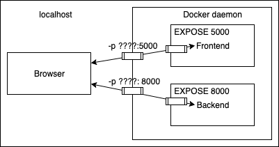

# Exercise
# 1.14. Environment (mandatory exercise)
## Instructions
Start both the frontend and the backend with the correct ports exposed and add ENV(opens in a new tab) to Dockerfile with the necessary information from both READMEs (front(opens in a new tab), back(opens in a new tab)).

Ignore the backend configurations until the frontend sends requests to backend_url/ping when you press the button.

***You know that the configuration is ready when the button for 1.14 of frontend responds and turns green.***

Do not alter the code of either project

To get the configurations right, it is important to understand the interplay of browser and the app.

- at first the browser gets HTML file and the JavaScript from the frontend container
- browser executes the JavaScript code, that renders the App and sets ut the button listeners etc
- once the button for Exercise 1.14 is pressed, frontend does a request to the backend container
how browser accesses the fronend and backend



So the key thing is that the frontend code is executed by the browser, the frontend container does not run any code, it just serves the HTML and the JavaScript code for the browser!

The following figure might help you with setting up the port mappings:



More info about connection of the fronend and backend

TIPS:

- When configuring web applications keep the browser developer console ALWAYS open, F12 or cmd+shift+I when the browser window is open. Information about configuring cross-origin requests is in the README of the backend project.
- The developer console has multiple views, the most important ones are Console and Network. Exploring the Network tab can give you a lot of information on where messages are being sent and what is received as a response!


Submit the edited Dockerfiles and commands used to run.


## commands to build and run 

```
docker build . -t frontednd
docker run -p 5000:5000 frontend

docker build . -t backend
docker run -p 8080:8080 backend

```