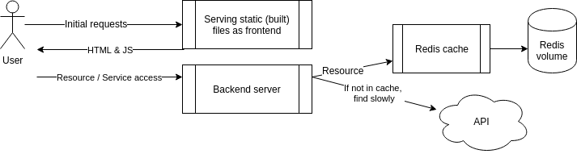

# Exercise
# 2.4. Redis (mandatory exercise)
## Instructions
In this exercise, you should expand the configuration done in Exercise 2.3 and set up the example backend to use the key-value database [Redis](https://redis.io/docs/latest/develop/) (opens in a new tab).

Redis is quite often used as a [cache](https://en.wikipedia.org/wiki/Cache_(computing))(opens in a new tab) to store data so that future requests for data can be served faster.

The backend uses a slow API to fetch some information. The slow API is accessed with /ping?redis=true. The frontend app has a button for doing this test.

You should improve the performance of the app and configure a Redis container to cache information for the backend. The setup looks like this:




You're correctly configured when the button for this exercise will turn green on click.

Hints:

- The backend [README](https://github.com/docker-hy/material-applications/tree/main/example-backend)(opens in a new tab) should have all the information that is needed for configuring the backend.
- The [documentation](https://redis.io/docs/latest/develop/)(opens in a new tab) of the Redis image might contain some useful info.
- [The restart: unless-stoppe](https://docs.docker.com/reference/compose-file/services/#restart)(opens in a new tab)d(opens in a new tab) configuration (for the backend) can help if the Redis takes a while to get ready.

Submit the docker-compose.yml as answer.

## commands
```
docker compose up
```