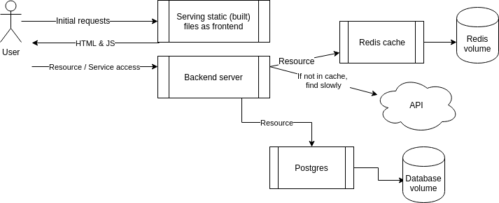

# Exercise
# 2.6. Postgres (mandatory exercise)
## Instructions
Let us continue with the example app that we worked with in [Exercise 2.4](https://courses.mooc.fi/org/uh-cs/courses/devops-with-docker/chapter-3/docker-networking#6ecbbdea-a420-4429-a2ac-9a88eed8c9db).

Now you should add a database to the example backend.

Use a Postgres database to save messages. For now, there is no need to configure a volume since the official Postgres image sets a default volume for us. Use the Postgres image documentation to your advantage when configuring: https://hub.docker.com/_/postgres/(opens in a new tab). Especially the part Environment Variables is a valuable one.

The backend [README](https://github.com/docker-hy/material-applications/tree/main/example-backend)(opens in a new tab) should have all the information needed to connect.

The project setup looks like the following:



There is again a button (and a form!) in the frontend that you can use to ensure your configuration is done right.

TIPS:

- When configuring the database, you might need to destroy the automatically created volumes. Use commands ``docker volume prune``, ``docker volume ls`` and ``docker volume rm`` to remove unused volumes when testing. Make sure to remove containers that depend on them beforehand.
- ``restart: unless-stopped`` can help if the Postgres takes a while to get ready
Submit the docker-compose.yml as your answer.

## commands
```
docker compose up

```